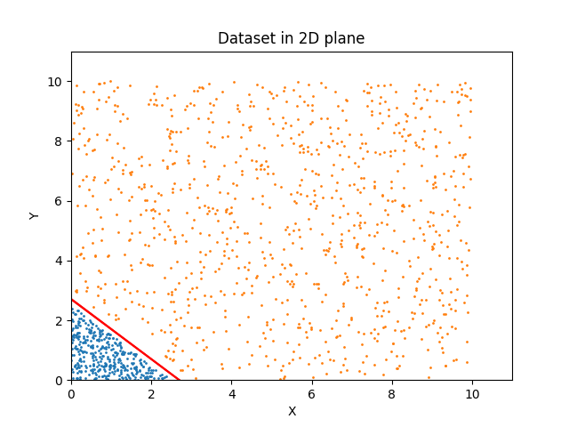

# Medium-Blog-Experiments

I am in the process of cleaning the code for readability. Please visit back later for the codes. Cleaning a code takes more time than writing it :)

This repo contains the codes for the experiments discussed in the blog posts [1](https://medium.com/@randomthingsinshort/neural-networks-explained-for-machine-learning-beginners-cff7e4c7fc5c) and [2](https://medium.com/@randomthingsinshort/neural-networks-explained-for-machine-learning-beginners-b2acc4d24a95). 

### The file descriptions are as follows: 
```
1. prepare\_data.py - The code used for generating all the datasets.
2. data\_plot.py - Plot the different datasets present in the repository. 
3. model.py - contains the keras implementations of the models explained. 
4. data/data\_E1.csv - dataset for the experiment 1.
5. data/data\_E1_inverted.csv - the dataset E1 with labels inverted.
6. data/data\_E2.csv - the dataset for experiment 2
7. data/data\_E3.csv - the dataset for experiments 3,4,5.
```

### To run the codes:

##### data_plot.py
```
usage: data_plot.py [-h] [-F FILE]

Help

optional arguments:
  -h, --help            show this help message and exit
  -F FILE, --file FILE  File containing the dataset to be plotted
```

##### model.py
```
usage: model.py [-h] [-F FILE] [-M MODEL] [-E EPOCHS]

Help

optional arguments:
  -h, --help            show this help message and exit
  -F FILE, --file FILE  File containing the dataset to be trained on
  -M MODEL, --model MODEL
                        Model number to run
  -E EPOCHS, --epochs EPOCHS
                        Number of epochs
```

### Experiment Numbers:
##### Experiment 1
Using the dataset in the follwing figure and a single neuron network 
<br>



##### Experiment 2
Using the dataset in the follwing figure and a single neuron network 
<br>


##### Experiment 3
Using the dataset in experiment 1 and the network in experiment 2. 

##### Experiment 4
Using the dataset in the follwing figure and the above network with three neurons in the first layer. 
<br>


##### Experiment 5
Using the same dataset with 3-10-10-1 neuron layers 